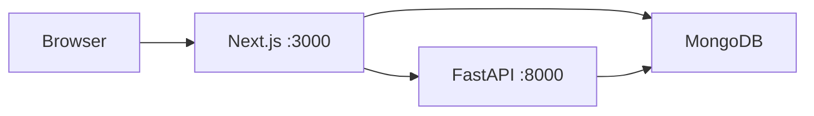

# Health System — Architecture & APIs (simple guide)

This document explains how **`Health_system/frontend`** and **`Health_system/backend`** fit together: which servers run, which APIs exist, and whether the Python backend is required.

---

## 1. Big picture (two “backends”)

Your app uses **two separate server processes**:

| What | Technology | Default URL | Role |
|------|------------|-------------|------|
| **Frontend app** | Next.js (pages + API routes) | `http://localhost:3000` | Browser UI, login, Mongo-backed dashboard API |
| **Python API** | FastAPI | `http://localhost:8000` | Case ingestion, listing by hash location, outbreak prediction |

They can both talk to **MongoDB**, but they use **different collections** for case-like data (see section 4).

- **Yes, the frontend can use the Python backend** — but only for specific features (see section 3).
- **The workspace dashboard can work mostly from Next.js** (`/api/health-data`) if your data lives in the Mongoose **HealthData** collection.

---

## 2. Where to look in the repo (navigation)

### Frontend (`Health_system/frontend/`)

| Path | What it does |
|------|----------------|
| `app/page.js` | Landing page |
| `app/login/` | Login UI → NextAuth |
| `app/register/` | Hospital / medical registration |
| `app/workspace/` | Main role dashboard (map, stats, reports, prediction) |
| `app/admin/` | Admin UI (protected) |
| `app/lib/api-client.js` | **Client helper for the Python API** (`NEXT_PUBLIC_BACKEND_URL`, default `http://localhost:8000`) |
| `app/lib/backend-adapters.js` | Maps Python case records ↔ UI shape |
| `app/api/health-data/route.js` | **GET/POST** dashboard health data (Mongo **HealthData**) |
| `app/api/auth/[...nextauth]/route.js` | NextAuth |
| `app/api/hospital/register/route.js` | Hospital signup → Mongo **User** |
| `app/api/medical/register/route.js` | Medical signup → Mongo **User** |
| `app/api/location/search/route.js` | Area search (external geocoding) |
| `app/api/admin/*` | Admin APIs (ASHA create, pending users, etc.) — guarded by `proxy.js` for ADMIN |
| `app/components/maps/` | Leaflet map |
| `proxy.js` | Next.js 16 **proxy** (replaces `middleware`): `/api/admin/*` requires **ADMIN** (401); other page routes require sign-in and redirect to `/login` (public: `/`, `/login`, `/register`). |

### Python backend (`Health_system/backend/`)

| Path | What it does |
|------|----------------|
| `app/main.py` | FastAPI app, mounts routers, `/health` |
| `app/api/cases.py` | Cases: ingest + `GET /api/v1/cases` |
| `app/api/predictions.py` | `POST /api/v1/predictions/outbreak` |
| `app/services/case_service.py` | Writes/reads **`ingestion_records`** in Mongo |
| `app/services/prediction_service.py` | Outbreak prediction (rules + optional LLM) |
| `app/config.py` | `MONGODB_URI` / `MONGODB_DB` (env: often `mongodb_uri` via pydantic) |
| `backend/README.md` | API reference for FastAPI |

---

## 3. Does the frontend use the Python backend?

**Sometimes. Here is the exact split.**

### Calls that go to **Python FastAPI** (via `app/lib/api-client.js`)

Used from the **browser** as a direct `fetch` to `NEXT_PUBLIC_BACKEND_URL` (default `http://localhost:8000`).

| Feature | HTTP | Defined in |
|--------|------|------------|
| Health check (registration flow) | `GET /health` | `app/register/register-form.js` |
| List ingested cases (6-digit location code) | `GET /api/v1/cases?location=…&limit=…` | `app/workspace/workspace-client.js` (fallback / merge) |
| Submit ASHA report (JSON) | `POST /api/v1/cases/asha/text` | `workspace-client.js` |
| Submit medical report (JSON) | `POST /api/v1/cases/medical-shop/text` | `workspace-client.js` |
| Outbreak prediction | `POST /api/v1/predictions/outbreak` | `workspace-client.js` |

If **FastAPI is not running**, those calls fail; the UI may still show **HealthData** from Next.js, but **prediction** and **ingestion listing/submit** that depend on Python will not work.

### Calls that stay on **Next.js only** (same origin, `/api/...`)

| Feature | Route | Notes |
|--------|--------|--------|
| Login / session | `/api/auth/*` | NextAuth, Mongo **User** |
| Full dashboard payload (reports + summary + risk + trends + entities + AI-shaped insights) | `GET /api/health-data` | Mongo **HealthData** + **User** entities |
| Create health report (if you POST from a client to this route) | `POST /api/health-data` | Writes **HealthData** (not the same as Python ingest) |
| Registrations | `/api/hospital/register`, `/api/medical/register` | Mongo **User** |
| Location search | `GET /api/location/search` | Server-side external API |
| Admin | `/api/admin/*` | Mongo, ADMIN gate |

The **workspace** loads **`GET /api/health-data` first**, then optionally **merges** Python **`GET /api/v1/cases`** so both data sources can appear on one map.

---

## 4. MongoDB: two different “case” stores

Both stacks can use the **same MongoDB cluster** (same URI) but **different collections / models**:

| Store | Used by | Collection / usage |
|-------|---------|---------------------|
| **HealthData** (Mongoose) | Next.js `app/api/health-data` | Rich reports: location names, verification, trust, aggregates for dashboard |
| **ingestion_records** (Motor) | Python `case_service` | Ingestion pipeline: 6-char `location` key, symptoms, transcript, trust from Python rules |

Submitting a field report from the workspace **today** goes to **Python** (`/api/v1/cases/.../text`), which fills **`ingestion_records`**, not necessarily **HealthData**. That is why the app **merges** FastAPI results into the list when HealthData already has rows.

---

## 5. Environment variables (quick reference)

### Frontend `.env` (typical)

| Variable | Purpose |
|----------|---------|
| `MONGO_URI` | Mongo for NextAuth, User, HealthData, admin APIs |
| `NEXTAUTH_URL` | e.g. `http://localhost:3000` |
| `NEXTAUTH_SECRET` | Session signing |
| `NEXT_PUBLIC_BACKEND_URL` | Python API base (default `http://localhost:8000` if unset) |
| `ADMIN_USERNAME` / `ADMIN_PASSWORD` | Static admin login (see `authOptions.js`) |

### Backend `.env` (typical)

| Variable | Purpose |
|----------|---------|
| `MONGODB_URI` | Python Mongo connection |
| `MONGODB_DB` | Database name (default `health_system`) |
| LLM-related (`LLM_PROVIDER`, `GEMINI_API_KEY`, …) | Prediction service |

**Tip:** For a coherent demo, point **both** apps at the **same database name** if you want related data in one cluster — but remember collections still differ (**HealthData** vs **ingestion_records**).

---

## 6. How to run locally (minimal)

1. **MongoDB** reachable with URI used by both apps.
2. **Next.js**: `cd Health_system/frontend && npm install && npm run dev` → `:3000`
3. **FastAPI** (for ingest + prediction + ingestion list): `cd Health_system/backend && uvicorn app.main:app --reload --port 8000` → `:8000`

You can open the workspace with only Next.js + Mongo if you only care about **HealthData**-backed views; enable FastAPI for **submit report**, **prediction**, and **ingestion_records** listing.

---

## 7. Further reading inside the repo

- **FastAPI endpoint details:** `Health_system/backend/README.md`
- **Frontend env + run:** `Health_system/frontend/README.md`
- **Single source for dashboard JSON shape:** `Health_system/frontend/app/api/health-data/route.js` (GET handler builds `summary`, `riskZones`, `aiInsights`, etc.)

---

*Last aligned with workspace behavior: loads `/api/health-data` first, then merges `/api/v1/cases` when needed.*
